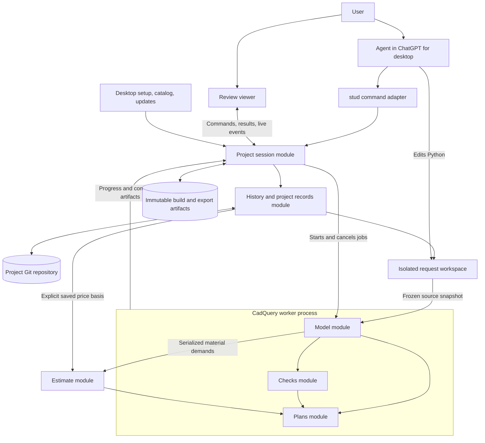
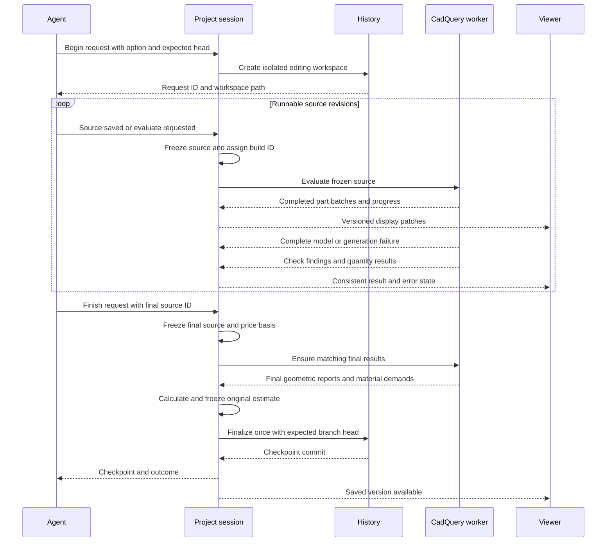
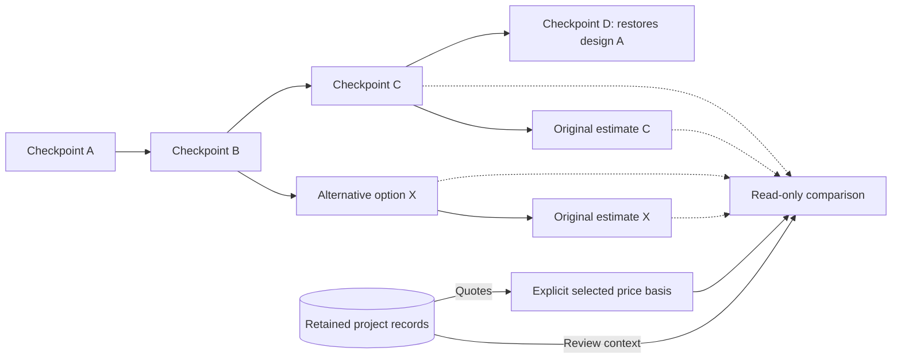
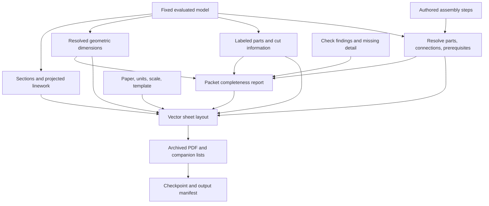

# stud implementation plan

September 9, 2026

Owner scope correction, September 9, 2026: legacy project and record migration is not required. Existing file preservation, native project recovery, and the other implementation and acceptance requirements remain in scope.

This plan implements the agreed [stud roadmap](ROADMAP.md). It specifies the system, its important interfaces, delivery order, and acceptance evidence. Interface names are proposed contracts, not existing functionality. No implementation code is included.

The user prompts an agent; the agent writes CadQuery in ordinary Python. stud evaluates the project, streams inspectable progress, preserves review prompts and Git history, compares designs and estimates, and generates printable plans. Workbenches and sheds are proving cases. Mansions remain in scope. Imports, editable external round trips, and automated structural analysis remain deferred.

**1. System design**

Use one local Python coordinator per open project, short-lived CadQuery worker processes, the existing Three.js browser viewer, and the desktop installer and project catalog. The coordinator owns project mutations and job scheduling. Workers own geometry execution and expensive geometric operations. The viewer consumes results and submits user actions.

The CLI and browser are adapters to the same project interface. A future standalone host can use that interface without changing project files or modeling semantics. Keep the modules below in the same application; they do not require independently deployed services.

| Module | Responsibility it owns | Important interface |
| --- | --- | --- |
| Project session | Request lifecycle, immutable source capture, worker scheduling, current display state, event delivery, crash recovery. | Begin, evaluate, finish, cancel, inspect status, subscribe. |
| History and project records | Git workspaces, commits and branches, restoration, saved quotes, anchored prompts, record batches, historical reads. | Open an editing workspace; finalize a checkpoint; read or compare versions; save records. |
| Model | Execute Python, collect named CadQuery shapes and design information, compose placements, produce shape archives and display data. | Evaluate a source snapshot; register completed output; query a specific evaluated model. |
| Checks | Measure geometric requirements and report evidence and coverage. | Evaluate a requirement set against a model. |
| Estimate | Turn material demands into purchase quantities and apply an explicit pricing basis. | Calculate an estimate; compare estimates and quantity changes. |
| Plans | Project geometry into drawings, resolve dimensions and step references, lay out and archive a printable packet. | Generate a plan packet for a fixed model and print specification. |
| Review viewer | Navigation, selection, animation, findings, comments, history comparison, and pricing interaction. | Consume a display snapshot and ordered patches; submit versioned actions. |

The Model module uses CadQuery directly. Its stud-specific interface handles project meaning and evaluation; it does not wrap every CadQuery operation or introduce interchangeable geometry engines. CadQuery already provides named assemblies and placements. Use those capabilities where they fit the contract. [CadQuery assemblies](https://cadquery.readthedocs.io/en/latest/assy.html)

The Estimate module consumes serialized material demands and does not require CadQuery execution. The coordinator routes demands, quotes, and estimate results between modules; the diagram shows those logical dependencies. Repricing can run independently of a geometry worker.

**2. Identity and version vocabulary**

These identifiers solve different problems and must remain distinct.

| Identifier | Meaning and lifetime |
| --- | --- |
| Project ID | Stable identity of the project folder, independent of its path or name. |
| Option ID | A named design branch. A rename changes its label, not the user's logical option. |
| Request ID | One user-requested editing operation, allocated before the agent edits. Also the idempotency key for finalization. |
| Source ID | Digest of the exact modeling source and declared modeling inputs captured for evaluation. Pricing-only changes do not change it. |
| Build ID | One execution attempt, including its source ID, runtime fingerprint, and build settings. Retrying the same source creates a distinct attempt. |
| Checkpoint | The Git commit containing the saved design, request record, estimating inputs, estimate snapshot, and relevant reports. |
| Object ID | Identity of a physical part, assembly, or other meaningful authored object across compatible edits. |
| Shape key | Identity of an immutable geometry asset within the build/cache protocol. It is not an object ID or proof of semantic continuity. |
| Price basis ID | Digest of the exact selected quote records and selection policy used by an estimate. |
| Estimate ID | Identity of a calculated line-item snapshot and its calculation inputs/version. |

Every cross-module result carries project ID, source ID, and build ID where applicable. Results associated with history also identify their checkpoint. Estimates additionally identify their price basis and estimating inputs. A comparison identifies both sides explicitly.

Store the request ID and source/build references inside the checkpoint record. Do not put a commit's own hash into a file that must be included in that commit. Resolve the commit hash from Git after finalization. Prompts addressed by a request can refer to its request ID before the commit exists; history supplies the resulting commit link.

**3. Project ownership and storage**

Use normal project files and Git. The paths below are proposed project-relative locations, not new app-wide databases.

| Storage | Contents | Retention |
| --- | --- | --- |
| Design source and project manifest | Python entry point and helpers; declared file inputs; runtime requirements; display and print preferences. | Versioned in Git. |
| Estimating inputs | Product selections, allowances, quantity overrides, budget assumptions. | Versioned with the design. |
| Quote records | Immutable saved quotes and explicit supersession or manual-override-clearing records. | Versioned in Git; retained across options. |
| Review records and captures | Prompt text, original target/context, screenshots, resolve/reopen actions, addressing request links. | Versioned in Git; retained across restoration. |
| Checkpoint report | Request intent, source/build references, execution and check summaries, original estimate, compact preview. | Versioned with the checkpoint. |
| Local session state | Active request, pending record writes, recovery journal, workspaces, current artifact pointers. | Durable locally until finalized or explicitly discarded; not treated as disposable cache. |
| Build artifacts | Shape archives, meshes, complete manifests, detailed reports, temporary projected drawings. | Rebuildable cache, with referenced artifacts pinned while needed. |
| Exported plan packets | Immutable PDF and companion lists plus a manifest identifying their source checkpoint and settings. | Retained in the project export folder; never overwritten by a later packet. |

Git captures the source and compact historical evidence. Exported PDFs remain project-owned deliverables. A full-folder copy preserves those files; a Git-only copy can regenerate an absent packet when the recorded runtime is available. Do not describe a rebuild with a different runtime as the original output.

New projects get a repository and baseline checkpoint. Preserve existing files and Git history; legacy conversion is not required. Never include unrelated user edits in an automatic checkpoint. Keep the existing desktop catalog separate; moving a project changes its registered path, not its design identity.

**Project-wide records across branches.** Quotes and review history must not disappear when another design option is activated. Store records with unique IDs, immutable contents, and explicit supersession or resolution relationships. The History module reads their union from retained option heads plus pending local records. Each checkpoint materializes the relevant accumulated records so its estimate and review context remain portable. A rebuildable index makes these reads cheap; there is no separate authoritative pricing database or hidden pricing branch.

Use a project-wide save sequence assigned by the single coordinator to identify the latest saved quote. Preserve quote date separately. Select quotes by product/specification, purchase unit, and quote kind, not by a generated part index. Conflicting records introduced through external Git changes require explicit reconciliation; timestamps alone do not settle them.

Save incoming review and pricing changes durably before acknowledging them. During an active design request, collect completed record batches for its final checkpoint. When idle, a completed record batch can create a record-only checkpoint using the same mechanism. The history interface distinguishes design, pricing, and review changes; saving a prompt does not submit it to the agent. Pricing batch grouping remains a working UI default to refine in testing.

**4. Request and checkpoint interface**

The agent explicitly begins a design-changing request, edits Python, evaluates the completed edits, inspects the result and finishes the request. File saves do not start builds. Finalization requires a completed evaluation of the current source.

| Operation | Required input | Result and contract |
| --- | --- | --- |
| Begin request | Project, target option, expected head, user intent, client request key. | Request ID and editing workspace. Reject a stale head or competing active writer. Repeated calls with the same key return the existing request. |
| Evaluate request | Request ID and optional expected source ID. | Build ID immediately; progress arrives separately. Capture immutable source before execution. A newer build supersedes an older build for the same request. |
| Finish request | Request ID, expected final source ID, request summary, addressed prompt IDs. | A finalization job, then exactly one checkpoint for changed design work. Retries return the same job or completed checkpoint. Finalize only the captured final source and its matching reports. |
| Cancel request | Request ID. | Stop scheduling/accepting its results and preserve the unfinished workspace for recovery. Cancellation alone does not discard edits or restore an older design. |
| Inspect project | Project. | Active option/head/request; displayed build; generation and check state; pending records; available last valid model. No implicit rebuild. |
| Compare versions | Two checkpoints and an explicit comparison price basis/mode. | Read-only comparison result or job ID. Never changes the agent's option, workspace, or starting head. |
| Create or activate option | Name/base checkpoint for creation; target option for activation. | Branch-backed option. Activation waits for the current editing request to finish or be explicitly canceled. |
| Restore design | Source checkpoint, target option, expected target head. | A new editing request seeded with the old design and estimating inputs. Rebuild and finalize as a new commit, preserving current project records and selected current prices. |

Use an isolated Git worktree for each active editing request, detached at its expected base commit. The agent receives that workspace path. Late file writes remain in that workspace after cancellation and cannot mutate a newly activated option. Read-only historical evaluations use cached source snapshots or separate temporary materializations. Git supports multiple worktrees, including detached ones. [Git worktrees](https://git-scm.com/docs/git-worktree)

One source-writing request per project is the initial rule. Users can inspect, compare, save comments, and edit prices while it runs. A project mutation lock serializes checkpoint finalization and option activation. Long geometry work runs outside that lock.

At finish, freeze the final source, selected pricing inputs, and included record batches; later record writes remain pending for the next checkpoint. Complete or classify evaluation, write the compact reports and original estimate, and create the commit. Advance the target branch only if it still points to the expected head. Git supports this expected-old-value check; an unexpected external commit produces a conflict instead of an overwrite. [Git reference updates](https://git-scm.com/docs/git-update-ref)

Use a small durable finalization journal. If the app stops between commit creation, branch advancement, and updating local display pointers, recovery locates the request's existing commit and completes the interrupted operation. It must not create a duplicate checkpoint. After success, synchronize the project checkout only after checking for unrelated local edits.

A checkpoint may contain failed checks or a generation error. If its source produced no complete model, record that outcome and an unavailable current estimate; a displayed previous model or estimate remains explicitly identified as previous. Interrupted requests remain recoverable drafts until the agent or user resumes or finishes them. A no-change request does not need an empty design commit.

**5. Model and authoring interface**

Python and CadQuery remain the modeling language. stud supplies a small registration interface for completed output and design information. It does not require the agent to express every operation through stud primitives.

| Authored information | Minimum contract |
| --- | --- |
| Assembly | Persistent ID, label, optional parent, local placement, source provenance. Hierarchy is organizational; it is not an inferred dependency graph. |
| Part | Persistent ID, parent assembly, completed CadQuery shape, placement, material/demand reference, source provenance. Registration takes an immutable snapshot of the shape. |
| Named reference | Object ID, stable reference name, and evaluated local geometric meaning such as a point, axis, plane, or boundary. |
| Requirement | Stable ID, measured relationship, explicit target references/scope, threshold and units, numerical policy, explanation. |
| Material demand | Material/specification, physical quantity basis, contributing object IDs, blank or purchased-item information, and any unresolved inputs. |
| Drawing definition | Named view or section, object scope, orientation/cut plane, dimension references, detail references, requested sheet grouping. |
| Assembly step | Stable step ID, instruction text, part/connection references, prerequisites, and intended view or exploded offsets. |

Reusable Python functions can return or register groups of parts. Make publication an explicit operation on completed parts or assemblies, so normal execution yields useful progress. Support a batch for a coherent group; do not publish a half-mutated shape. Re-publishing the same object within a build requires an explicit replacement operation. Duplicate accidental IDs fail the build.

Keep object identity in authored source. Repeated members need meaningful persistent keys when continuity matters; a newly generated positional index is not enough. Splits and replacements can carry lineage for explanation, but lineage does not automatically transfer comments. A missing named reference becomes unresolved. Do not equate a CadQuery face index or a hash of tessellated geometry with a persistent design reference.

Use the project's native units (`in` or `mm`) throughout the geometry interface, with X/Y horizontal and Z up. Choose units at creation and keep them fixed across edits and options. New US construction projects default to inches; model actual imperial stock directly, such as a 1.5 × 3.5 inch 2×4. Native solids, meshes, measurements, stock and drawings retain those values; no project unit conversion is implicit. Preserve fractional formatting in imperial labels. This replaces the original millimeter-only choice per the owner's September 10 correction (D026). Placements are rigid local transforms composed through the assembly hierarchy. Apply reflection or scaling to the solid before publication rather than letting the viewer invent different geometric meaning. Maintain a separate local display origin for large coordinates if measurements justify it.

The worker produces an evaluated-model manifest, native shape archives, and per-shape display assets. Each placed instance references a shape asset and transform. The manifest records source provenance, object membership, dimensions, requirements, materials, and plan definitions. Keep shape assets separate from instance identity so repeated parts can share display data.

CadQuery exposes shape serialization and geometric queries; use native shape archives to reopen a completed build for later measurements and drawings. Cache compatibility includes the runtime fingerprint. These archives are internal persistence, not a commitment to support user model imports. [CadQuery shape reference](https://cadquery.readthedocs.io/en/latest/classreference.html#cadquery.Shape)

Build from a frozen set of declared project files. Verify the source set stayed stable while capturing it; retry capture if it changed. Pin runtime versions and record relevant settings. Price fetching happens outside geometry evaluation. Untracked file, environment, clock, random, or network dependencies prevent a claim of reproducible evaluation and disable reuse until made explicit. Do not attempt to infer a complete dependency graph from arbitrary Python.

**6. Live build and display interface**

Expose versioned JSON HTTP operations for commands and reads, plus a server-sent event stream for progress. Evaluation, finalization, comparison, and plan generation return a job identifier promptly; the CLI may wait on that job, while the browser follows events or reads its status. Send geometry as referenced binary assets rather than embedding large meshes in event messages. Keep ordinary reads fast and free of rebuild side effects.

Every mutation carries an idempotency key and the relevant expected revision. Errors return a stable category, human-readable explanation, expected/current identifiers, affected references, and whether retry is appropriate. Distinguish a stale target, changed branch head, busy request, unresolved reference, failed generation, and unavailable artifact. These semantics are shared by both adapters; transport failures must not be confused with a geometric finding.

| Event | Payload and viewer behavior |
| --- | --- |
| Build started | Request, source, build, and option identifiers; expected predecessor display version. Establish a distinct candidate scene. |
| Part batch available | Ordered batch, object IDs, shape asset references, placements, and explicit additions/replacements. Show those objects as candidate geometry. |
| Progress | Stage and completed work where measurable. Do not fabricate percentage completion from unknown total work. |
| Geometry complete | Authoritative full object inventory and manifest reference. Only now treat omitted prior objects as removals. |
| Checks updated | Findings and coverage tied to this build, with referenced objects and measured evidence. |
| Estimate available | Estimate ID, model/build reference, price basis, and completeness. |
| Build ended | Complete, generation failed, canceled, or superseded; final available artifacts and diagnostics. |
| Checkpoint created | Request ID, commit, and final source/build references. |

Every event includes a schema version, project ID, build/request ID as appropriate, and monotonic stream sequence. Duplicate events are harmless. A reconnect resumes from its last sequence; if retained events cannot cover the gap, load a current snapshot before applying more patches. The snapshot declares its sequence so replay cannot skip a concurrent update. Missing or corrupt mesh assets are display errors, not silently absent parts.

Use a bounded queue per subscriber. Slow viewers recover through a snapshot rather than accumulating an unlimited event backlog. This is transport recovery, not a new persistent event-sourcing platform.

The viewer keeps four pieces of state separate: active editing target, latest build attempt, displayed model, and last valid complete model. History inspection changes the displayed model only. Validation state is separate from execution state. The manifest records completion independently for geometry, checks, quantities, estimates, and plans; failure in a later stage does not erase an already complete geometric result.

| Situation | Display and artifact behavior |
| --- | --- |
| Source being written, no runnable result | Retain the earlier model with its version label and an editing indicator. |
| Partial geometry available | Show available candidate objects; any retained prior context is visibly separate and excluded from candidate totals. |
| Complete geometry with failed checks | Display the complete candidate and highlight its findings. Keep it available for inspection and history. |
| Generation fails after partial output | Preserve usable partial output as incomplete, show the error, and offer the last valid complete model. |
| Generation fails before output | Keep a clearly identified earlier model; do not relabel it as the failed source. |
| All required checks pass with complete coverage | The complete build can become the last valid model. An empty or unchecked requirement scope is not proof of coverage. |
| Build superseded or canceled | Ignore its late state changes. Retain artifacts only when history or feedback references them. |

Write artifacts into an immutable build directory. Expose a completed result through one manifest pointer after its files are ready. Do not independently overwrite model, checks, and quantity files and hope readers see a consistent combination.

Maintain camera and selection through updates where their object identities remain valid. Capture the addition animation the user likes before changing the viewer implementation and preserve its behavior. Animate genuine additions and useful motion changes; reconnecting, replaying events, or opening a saved checkpoint must not pretend that unchanged objects were just created. Measurement uses the requested version's geometry, independent of temporary animation or explosion transforms.

**7. Geometric checks and measurement interface**

Checks accept an evaluated model, requirement set, and numerical policy, and return findings plus coverage. Each finding identifies the requirement, affected objects/references, measured value and units, expected condition, tolerance, and evidence location. Execution failure, unsupported measurement, missing target, passed condition, and failed condition remain distinguishable.

Use broad-phase bounds to find candidate interactions and the actual CadQuery solids for the final measurement. Bounds alone cannot establish collision, fit, or contact. Test geometric contact and clearance separately: zero minimum distance does not establish a required contact area or bearing orientation. Stock-fit checks operate in the part's stock frame and account for its stated blank. Required connections and supports are geometric relationships here; structural analysis remains deferred.

Coverage reports which requested relationships were evaluated, skipped, or unresolved. Automatically generated requirements help describe intent, but independent fixtures must detect omitted supports, incorrect scopes, and faulty generator outputs. Do not copy the generator's calculations into the test oracle.

The measurement operation accepts a specific build and named or picked geometric references. It returns a measured result and tolerance, or an explicit stale/unresolved-reference result. Picking a mesh triangle can identify a target for a query, but the mesh approximation is not the final dimensional authority.

**8. Review prompts and history comparison**

| Operation | Input | Required behavior |
| --- | --- | --- |
| Save prompt | Prompt ID/text, displayed source/build, target part or captured region, camera/context, screenshot where applicable. | Save against what was actually displayed, even while another build runs. Return the same prompt on retry. |
| Read prompts | Project and optional option/checkpoint/status filter. | Return text, original context, current target-resolution state, and addressing request/commit links. Does not submit or resubmit prompts. |
| Resolve or reopen | Prompt ID, expected prompt revision, new state, optional addressing request. | Preserve previous actions; reject stale concurrent updates. |
| Show | Expected displayed build/checkpoint and target objects or region. | Focus the correct model and return what was shown. A version mismatch is explicit. |
| Compare | Two checkpoints, views, and price comparison mode. | Load two isolated display states with linked cameras where useful; return object, requirement, material, and estimate differences. |

Retain a frozen context for prompts created during an uncommitted or partial build: screenshot or target snapshot, source reference, and enough captured source context to explain the original request. Pin referenced draft context until it has been archived with the review record. Cache cleanup must not erase the only surviving context.

Report added, removed, moved, reshaped, and replaced objects. An object with changed placement but the same shape is different from a new object with coincident geometry. Shared IDs provide a basis for correspondence; ambiguous replacement stays ambiguous. Resolving a prompt on one branch does not imply that its change exists on another branch; show the addressing checkpoint and whether it belongs to the viewed option's history.

D has A's design and design-specific estimating inputs, with current selected prices and retained review history. It is a new commit after C. Comparing C with X does not switch the agent away from either its current option or its active request workspace.

**9. Quantity and estimate interfaces**

Separate geometric demands, purchasing decisions, quotes, and calculated totals.

| Record or operation | Contract |
| --- | --- |
| Material demand | Part IDs, material/specification, physical quantity and units, stock/blank information, quantity basis, and completeness. |
| Purchase plan | Selected stock lengths, sheet or pack sizes, quantities, cutting loss/allowances, overrides, and explanation linking demand to purchases. |
| Quote record | Stable record and product IDs, specification, purchase unit and pack size, price as decimal, currency, supplier/source/evidence, quote date, save sequence, quote kind, superseded record if any. |
| Calculate estimate | Model demands, design estimating inputs, explicit quote selection, calculation version. Returns line items, totals, missing information, price basis, and a saved snapshot. |
| Compare estimates | Two historical snapshots, or two design demand sets repriced with one explicit quote basis. Returns aligned lines and explained differences. |

A material's specification and purchase unit must match before a quote applies. Unit prices and quantity overrides live in different records. Preserve manual-over-sourced-over-estimated quote precedence, while allowing an explicit saved selection. Missing prices remain missing, not zero. Use decimal arithmetic and record rounding, tax, contingency, and currency assumptions; do not combine different currencies without an explicit conversion basis.

Historical comparison reads the saved estimates exactly as reported. Common-price comparison applies the same saved quote basis to both designs. It separates changes in geometry/material demands from changes in design-specific allowances, quantity overrides, or budget assumptions; common quotes alone do not make those assumptions identical. Show substitutions and unmatched lines explicitly.

Current repricing of an older design uses the latest applicable saved quote records by default. It produces a new comparison result without editing the old checkpoint. Quotes saved on another retained option remain eligible through the project-wide record view. An old calculation's recorded total is never silently replaced by a new estimator.

Pricing-only updates reuse geometric demands and do not rerun CadQuery unless a declared modeling input changed. Begin with straightforward stock planning and explicit sheet detailing; add optimization only when it improves demonstrated purchasing or cutting workflows.

**10. Printable plans interface**

Plan generation is a separate job for a fixed model/checkpoint. It is not a screenshot of the current browser or an export of its animation state.

| Input/output | Important fields and invariants |
| --- | --- |
| Plan request | Checkpoint, evaluated model, print specification, requested views/steps, optional estimate and explicit price basis. |
| Print specification | Paper size, printable margins, units, scale policy, typography/line sizes, sheet grouping, and template version. |
| Drawing view | Object scope, projection/cut plane, hidden-line policy, detail references, world-to-sheet transform. |
| Dimension | Geometric reference pair or measured feature, measurement type, evaluated value, formatting, placement preference. |
| Assembly step | Stable step ID, text, actual part/connection IDs, prerequisites, view and exploded presentation. |
| Plan result | PDF, companion lists, sheet index, unresolved references/findings, and artifact manifest containing checkpoint/build and generator/template versions. |

Use CadQuery/OCCT for geometric sections and projections. Its SVG export provides a useful first path for projected linework; annotations, scale control, sheet composition, and construction instructions remain stud work. Use ReportLab for vector PDF layout, text, tables, and final page composition, testing the projected-vector conversion in the first slice. [CadQuery SVG export](https://cadquery.readthedocs.io/en/latest/importexport.html#exporting-svg), [ReportLab documentation](https://docs.reportlab.com/reportlab/userguide/ch1_intro/)

Measure from model geometry and then project reference points onto the sheet. Never derive a printed dimension by measuring screen pixels. In the first milestone, verify a known physical length at the stated print scale and a readable home-printer layout. Include a scale-check mark and explicit print-scaling instructions so automatic printer fitting is detectable.

Assembly steps are agent-authored design information. Validate referenced parts, connection details, prerequisite cycles, and stale dimensions. The agent revises ordering and wording when a design change invalidates them; the application can flag these dependencies without claiming to infer a correct construction sequence from solid geometry alone.

Cut lists distinguish finished geometry from the starting blank and specified operations. Arbitrary solid geometry may not contain enough information to describe a reproducible cut; require explicit cut information where the packet needs it. Panel layouts must identify actual sheets, joints, cuts, and supported edges before being presented as cutting layouts.

Complete geometry with failed requirements can still produce an explicitly marked review packet containing its findings. Partial geometry can produce a diagnostic view, but not an apparently complete construction packet. Plan completeness, geometric check coverage, and estimate completeness are separate reported results. Validate the standard DIY packet with actual readers and printed pages.

**11. Failure handling and operational guarantees**

| Failure or race | Required response |
| --- | --- |
| Python exception or worker crash | Preserve diagnostics and completed artifacts, including partial geometry when that is all that exists. Identify the interrupted stage and keep the coordinator and viewer responsive. |
| New source while a build runs | Supersede the old build. Stop it where practical; reject all late changes to current state. |
| Failed or expensive geometric query | Return failure/unsupported status with targets and operation context; do not substitute a passing bounds check. |
| App crash during save/finalization | Recover from journal and request identity; acknowledge only durably saved records; avoid duplicate commits. |
| External Git changes or unexpected source edits | Reject stale mutations, preserve the request workspace, and reconcile explicitly. |
| Missing historical runtime | Show archived evidence and identify unavailable regeneration; do not silently use another runtime as historical truth. |
| Lost event connection | Resume by sequence or reset from a versioned snapshot. |
| Stale comment, show, or measurement target | Report the mismatch or unresolved reference; preserve original context. |
| Export failure | Keep the earlier export intact; expose the failed job and its intended source version. |

Workers provide fault isolation and cancellable execution. Keep local server access limited to the project session, retain same-origin protections for writes, and ensure artifact paths cannot escape their project. Long calculations must not run inside an HTTP request or Git mutation lock. These protections belong in the shared interface implementation so the CLI and viewer receive the same guarantees.

**12. Integration with the existing application**

Preserve behavior selectively, then remove superseded paths. Existing legacy projects retain their established workflow; the old parts representation does not become the new model contract. Migration is outside the corrected scope.

| Existing area | Implementation action |
| --- | --- |
| Build and server flow | Replace rebuild-on-read and independently replaced output files with explicit jobs, immutable result bundles, and fast status reads. Separate geometry availability from validation success. |
| Python model and assemblies | Introduce CadQuery authoring and completed-output registration. Port demonstrated reusable construction definitions and independently validate their results. |
| Custom geometry and validation | Replace duplicated shape interpretation with CadQuery shapes and evaluated references. Retain useful requirement intent and independent expected results, not assumed correctness of existing calculations. |
| Browser viewer | Retain navigation, inspection, pricing interaction, screenshots, and the liked animation. Replace whole-scene reconstruction with versioned manifests and object patches. |
| Comments | Preserve IDs, screenshots, original snapshots, and resolve/reopen behavior. Add source/build anchors and addressing-request links without silently reattaching legacy targets. |
| Pricing | Save quotes with source/date evidence, separate quantity overrides from quote records, and preserve each native checkpoint's original estimate. |
| Desktop shell | Retain setup, remembered projects, missing-folder behavior, runtime installation, and updates. Extend bundled execution to include the pinned CadQuery and PDF dependencies. |

These actions are grounded in the current [build flow](../build.py), [local server](../serve.py), [viewer](../web/app.js), [comment storage](../comments.py), and [pricing storage](../pricing.py). The implementation should record the current animation from the running product before replacement; static source inspection alone does not establish that interaction's full behavior.

**13. Ordered implementation work**

Each package ends in an observable result and interface-level acceptance checks. The identifiers correspond to the roadmap's five milestones.

| Package | Work and dependency | Acceptance evidence |
| --- | --- | --- |
| 1A — Project and version spine | Establish IDs, runtime manifest, frozen source capture, request workspace, artifact manifest, and basic request finalization. | Save/reload; distinct source/build/checkpoint identities; repeated finish creates one commit; no unrelated edits captured. |
| 1B — CadQuery evaluation | Register named assemblies/parts; compose placements; serialize shapes; generate display assets; preserve source references. Depends on 1A. | Workbench, rotated opening, and roof joint; valid and invalid operations; mirrored detail; instance identity through edits. |
| 1C — First outputs and packaging | Add initial independent checks, material demands, one dimensioned PDF sheet, and bundled-runtime trials. Depends on 1B. | Expected lengths, cuts, clearances, and quantities; printed scale/legibility; runtime starts on macOS and Windows. |
| 2A — Live jobs and viewer | Implement publication batches, ordered events, snapshot recovery, cancellation, and scene patches. Depends on 1A–1B. | Actual intermediate geometry; unchanged camera/selection; liked addition animation retained; late results ignored; reconnect is correct. |
| 2B — Review loop | Add versioned prompts, original captures, findings, show/measurement operations, and checkpoint links. Depends on 1C and 2A. | Widen an opening; inspect errors; resolve a prompt; delete its target; fail mid-build; retain understandable context. |
| 3A — Git alternatives and recovery | Add compare, create/activate option, restore-as-new-commit, project-wide records, and finalization recovery. Depends on 2B. | Compare during editing without retargeting it; restore from an older version; preserve alternatives and review history; crash/retry yields one checkpoint. |
| 3B — Reproducible cost comparison | Implement purchase demands, immutable estimates, both comparison modes, and pricing batches. Depends on 1C and 3A. | Independent line totals; missing-price handling; latest saved quotes across branches; historical totals survive estimator changes; price edits avoid geometry rebuild. |
| 4A — Detailed DIY project | Complete project-owned reusable bench/shed example definitions, explicit connections, blanks/cuts, sheet detailing, drawing and step references. Keep specific models outside the construction API. Depends on 2B and 3B. | Resize, relocate, and revise details; preserve deliberate exceptions; independently check part and purchase quantities. |
| 4B — Standard plan packet | Add sections/details, consistent labels, multiple sheets, assembly steps, completeness reports, and immutable exports. Depends on 4A and 1C. | A DIY reader follows the printed packet; dimensions, parts, cuts, and steps agree; a revision updates every affected output. |
| 5A — Building workloads and measured optimization | Exercise a representative mansion and optimize measured costs. Instrumentation starts in 1B; optimization follows demonstrated bottlenecks. | Local/shared/global edits and comparisons meet chosen latency and memory targets; optimized and full results agree. |
| 5B — Native release integration | Complete installers, signed updates, runtime compatibility/recovery, and full-folder reopen. Packaging trials start in 1C. | Native macOS/Windows installation; reopen and update preserve projects, prompts, prices, history, and saved packets. |

Start with 1A–1C as the first vertical slice. Keep initial tables and interfaces limited to fields those examples exercise. Do not build a general dependency graph, geometry plugin system, custom constraint solver, full building ontology, or collaborative editing framework ahead of demonstrated need.

**14. Verification and performance plan**

Tests cross the same interfaces as the agent and viewer. Use hand-specified geometry and quantities, intentionally broken examples, and request/race sequences with known outcomes. Preserve useful existing tests only where their expected behavior still applies.

| Test group | Cases that must be covered |
| --- | --- |
| Geometry and identity | Rotated and nested placements; sloped/bored parts; nearly coincident faces; invalid solids; insertion/removal; replacement; named-reference invalidation; local exception after regeneration. |
| Lifecycle and history | Multi-save request; duplicate finish; cancel and late writes; stale branch head; restore during active work; interrupted commit publication; historical inspection without active-target changes. |
| Viewer and feedback | Partial output; missing assets; dropped/replayed events; candidate versus prior geometry; prompt on an old or partial build; deleted target; animation and camera continuity. |
| Quantities and money | Blank versus finished size; panel versus area allowance; unit/pack conversion; manual/source precedence; overrides; missing quotes; same-price and historical comparisons; changed estimating assumptions. |
| Plans | Model-to-sheet transform; printed scale; clipping and overlapping labels; section consistency; part labels; cut details; dangling/cyclic steps; old packet preservation. |
| Packaging and recovery | Supported native platforms; missing runtime; relocated project; app update; native quote/feedback preservation; unrelated files left intact. |

Record elapsed time and memory for source capture, execution, solid queries, tessellation, transfer, scene update, plan generation, estimate calculation, historical reads, and comparison. Include a workbench, detailed shed, repeated framing case, and representative mansion with mixed geometry complexity. Choose performance targets from measured tasks and acceptable interaction delays; do not substitute an arbitrary part-count promise.

Optimize in this order when measurements support it: reuse display assets and patch objects; avoid irrelevant geometry work for price-only changes; prioritize current builds over background comparisons; cache deterministic geometry; then track dependencies for partial regeneration and targeted checks. Cache keys include source/dependency versions, parameters, assets, runtime, units, and tolerances. Mesh settings additionally affect display assets. Stock planning, drawing references, and neighboring geometric relationships can invalidate beyond the edited part.

Every optimized path is compared with full evaluation through adversarial edit sequences. A faster result with stale geometry, quantities, findings, instructions, or prices fails acceptance.

**First deliverable:** a workbench component authored in CadQuery that appears in the viewer, produces an independently checked material list and a dimensioned printable sheet, and saves one recoverable Git checkpoint for one completed agent request. Extend the same interfaces to the rotated opening and roof joint before expanding the catalog.
