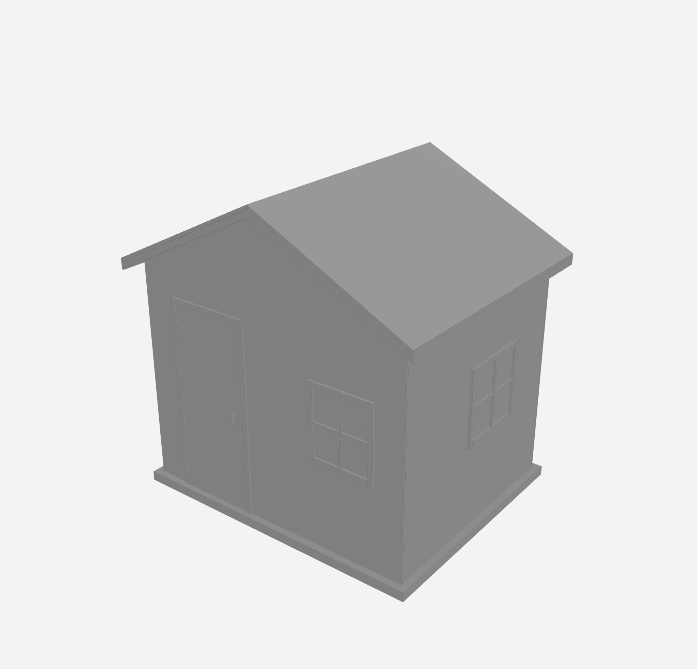
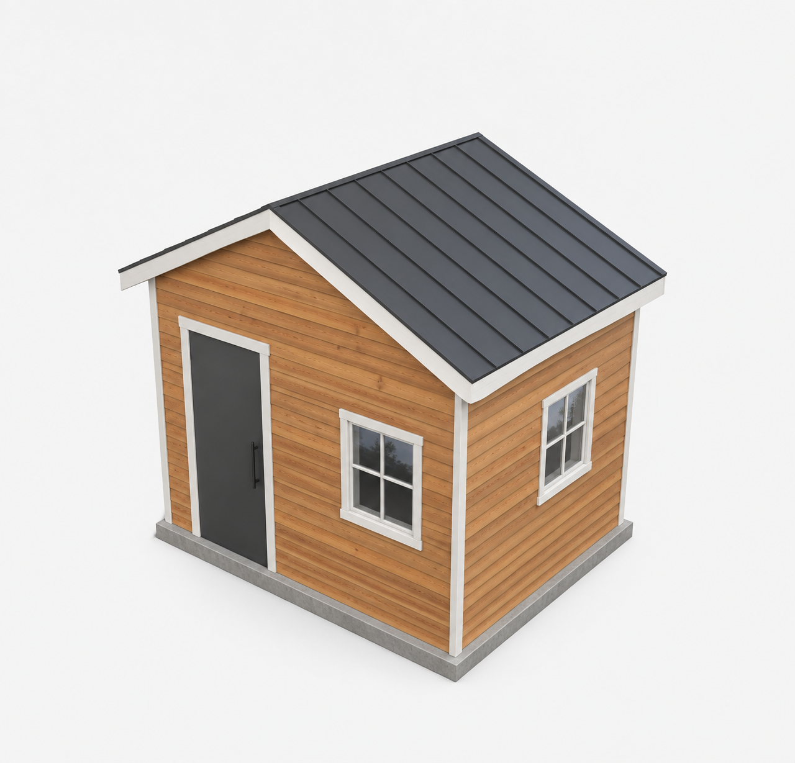
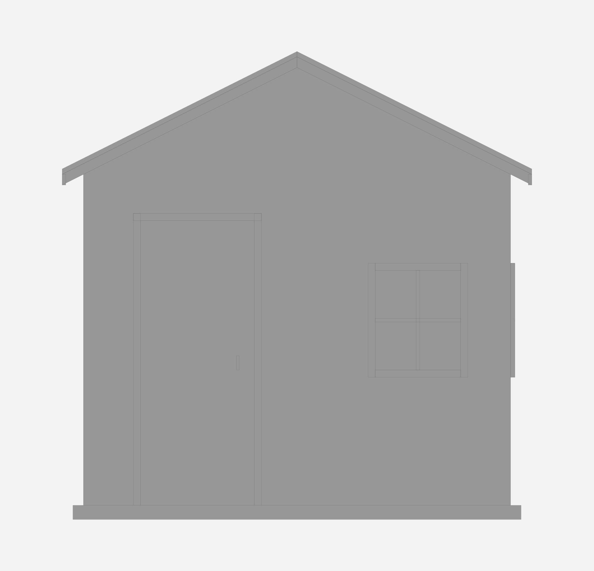
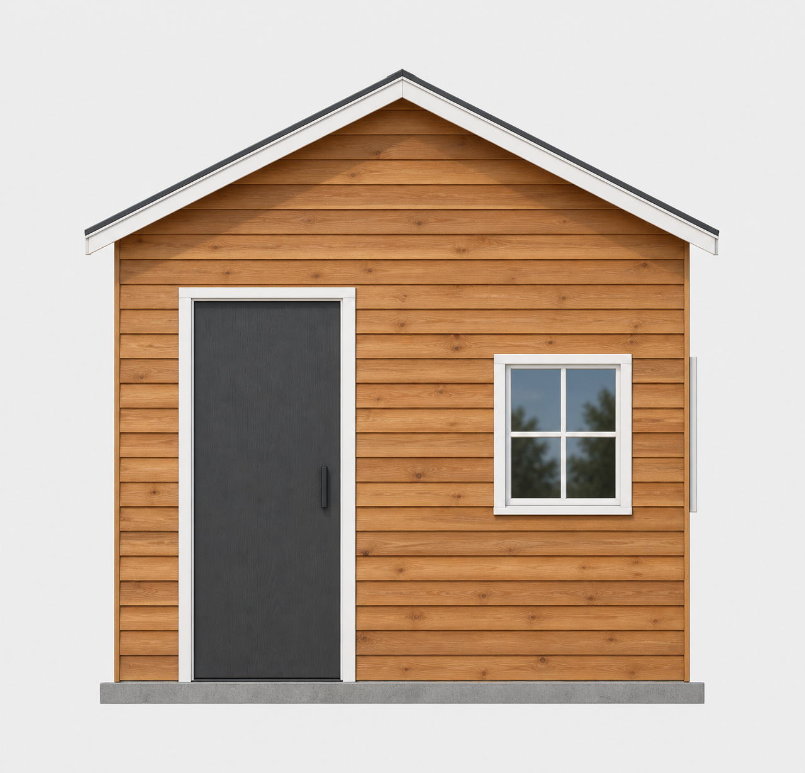

# HD rendering acceptance — 2026-09-10

Issue [#18](https://github.com/getstud/stud/issues/18) was exercised using the real native coordinator, the Codex in-app browser's registered WebMCP tools, and Codex's built-in image-generation tool. Generated PNG provenance identifies `gpt-image`, version `2.0`. No API key or custom image-generation backend was used.

## Combined request

Input intent: **“Show me how this would look with cedar siding.”**

The temporary project was created by `scripts/render-reference-fixture.py` from `tests/fixtures/hd-shed.py`: a 10 × 8 foot simplified shed envelope with a single door at front left, one four-pane window at front right, another on the right wall, a gable roof, fascia, and concrete plinth. This is an appearance fixture, with incomplete construction checks/quantities explicitly retained in the build metadata.

1. Read the real viewer using `list_options`. The displayed source used `SIDING = 'fiber_cement'` and `FINISH = 'sage paint'`; its initial checkpoint was `29bf06395ea19568ff4a5358fd94192a53a9a59d`.
2. Called `stud begin` with that expected head, the exact combined intent, and key `hd-cedar-demo`. Edited only the returned request workspace: `SIDING = 'cedar'` and `FINISH = 'clear matte sealant over western red cedar'`. Both the actual part material (`siding.cedar`) and purchasing specification changed.
3. Captured source `d269dc6fe314116bd62a4b0f8daf40e356820737f9e5fe3bd06227452bf845d0` and completed `stud finish`. Result: checkpoint `b6d1a8908f80402df1dccf2c05d6e24ac62c1503`, build `build_61de69f4a7824ede9f4faa04536eef18`, status `complete`.
4. Called the actual WebMCP `show` for perspective with the expected revision, followed by `capture_render_reference`. The returned brief contains the cedar specification, source/build/checkpoint, exact camera, all 30 part IDs, finishes and lighting. Camera, selection, editing target and displayed identity matched before and after this capture.
5. Inspected the resulting PNG and passed it with the generated brief prompt to the built-in image-generation tool. The resulting cedar visualization was presented directly in the conversation.
6. Called `show` with `view: front`, captured a fresh orthographic reference, and generated/presented the second image. The saved front reference remained fixed while the live viewer was subsequently navigated. A before/after check across those separate calls observed navigation, so it is not claimed as an uninterrupted front-camera preservation test; exact scene/camera non-mutation is separately covered by the focused tests and the perspective live check.

All scenario actions used project commands and WebMCP; no keyboard or mouse operation was needed to edit, capture, generate or present the images. This verifies the hands-free agent/tool workflow from the stated intent. It does not claim a microphone recording or speech-recognition test.

## Perspective: reference and generated result

[Exact capture brief and generation prompt](hd-rendering/cedar-perspective-brief.json). Input: 2048 × 1968 PNG. Output: 1280 × 1229 PNG.

| Criterion | Observed result |
| --- | --- |
| Geometry | Retains the gable form, door on the left, one front/right-side window, four panes in each, roof overhangs and slab. Adds white vertical corner boards absent from the reference. |
| Proportions | Overall envelope and relative opening locations remain recognizable. Door pull is noticeably longer than the modeled 4-inch pull; trim is somewhat heavier. |
| Viewpoint | Retains the elevated front/right perspective and visible roof plane. Slightly enlarges/reframes the subject compared with the input; not a pixel-exact camera match. |
| Materials | Plausible cedar lap siding and grain, charcoal standing-seam metal roof, charcoal door, white fascia/window/door trim, and gray concrete. Correct broad assignments; added corner trim is an unauthorized white surface. |
| Lighting | Convincing soft studio lighting and contact shadows. Window reflections invent trees, despite the requested neutral reflections/background. They are not evidence of the user's surroundings. |

Useful for judging the cedar/charcoal/white palette and overall appearance. The extra trim and enlarged hardware mean it is unsuitable for checking construction details or dimensions. This first output remains the main demo.

## Front elevation: new reference, new generation

[Capture brief](hd-rendering/cedar-front-brief.json) · [Exact generation prompt](hd-rendering/cedar-front-generation-prompt.txt). Input: 2048 × 1968 PNG. Output: 1280 × 1229 PNG. The generation prompt adds explicit orthographic-front guidance to the captured brief; this projection guidance is now included automatically in the tool's prompt.

| Criterion | Observed result |
| --- | --- |
| Geometry | Preserves the front gable silhouette, left door, right four-pane window and even the narrow protruding right-wall window trim at the silhouette. No side wall is newly exposed. |
| Proportions | Door/window size and placement closely follow the reference visually. Door handle is again larger; wood grain, cladding seams and trim surface detail are illustrative. |
| Viewpoint | Keeps the requested flat front elevation, parallel verticals and nearly identical framing. This is the stronger of the two examples for viewpoint fidelity. |
| Materials/lighting | Cedar, charcoal door/roof edge, white trim and concrete read correctly. Again invents trees in the glass reflections; these were not supplied by the reference. |

The final preparation prompt explicitly preserves projection and warns against invented corner boards, trim, hardware and frame subdivisions. These instructions reduce ambiguity, but do not guarantee exact image-generation fidelity. Inspect each result against its own saved geometry reference and retain the 3D viewer for exact inspection.

## Implementation checks

- All 98 JavaScript tests pass. The seven focused render tests exercise saved-version/material binding, hidden-part handling, invalid/stale/incomplete/failed views, exploded/drawing refusal, cancellation and save failures. A Three.js scene test checks untextured rendering, exact world transforms and camera matrices, helper removal, resource cleanup, and preservation after injected GPU failure.
- All five focused Python tests pass, covering bounded immutable PNG/brief persistence, path confinement, invalid/non-finite inputs, native/legacy HTTP routes with same-origin/JSON/request-size checks, and a real CadQuery model with different finishes on parts sharing one product ID.
- Actual native WebMCP capture persisted readable PNG/JSON artifacts and correctly included the changed material specification. The viewer remained interactive and available for further navigation.
- The full Python run completed 253 tests with 252 passes and one error: `test_finish_once_excludes_unrelated_edits_and_updates_checkout` found no `rows` in a saved estimate. This test passed when rerun in isolation, and all 18 tests in its session module then passed together (108 seconds). Its session, estimate and test code are unchanged from base `84a00ef`; the original failure is retained here rather than reported as a clean full-suite pass. The initial Python discovery preceded the new material regression; that additional test passed in the focused five-test run above.
- Independent code review identified and then verified fixes for per-object material binding, immediate readiness refresh on build-start/cancel events, and rejection of canceled/interrupted/superseded live builds. No actionable findings remain. `node --check web/app.js` and `git diff --check` pass.

The saved image briefs above retain their original capture provenance. Current captures use `materials[].specifications` arrays, grouped by product and per-part specifications, so two differently finished parts using the same product remain separate assignments. Hidden parts cannot supply finishes to a visible part.

## Shared viewer integration

The feature owns `web/render-reference.js` and its `capture_render_reference` descriptor. It accepts `execute(input, {signal})`, checks cancellation before capture/save and after awaiting save, and never changes the live renderer or scene. Its small adapter in `web/app.js` supplies the displayed model and final animated mesh positions.

The release integration registers the descriptor through `registerControlledTools([renderReferenceTool])`. #24 owns the shared runner, glow, input lock and Stop behavior. Its final tree at `e386edd` is identical to the rebased `cf1e79f` in [PR #29](https://github.com/getstud/stud/pull/29). No HD-specific changes to the centered #19 picker or viewer markup/styles are needed.

The actual `createViewerToolRunner` / `createControlActivity` from #24 commit `6bb9fca` were exercised with this feature descriptor in an isolated Node check. Stop canceled a pending save's successful response and a queued second capture; activity was released, no second capture ran, viewer state was unchanged, and a subsequent fresh capture succeeded with shared context attached. This checks the shared contract without importing unrelated #24 changes into the feature branch.

## Release integration checks

The complete integrated `npm test` run passes: **258 Python tests in 506 seconds, followed by all 130 JavaScript tests**. This includes the previously intermittent session cases in the same full run. JavaScript syntax and diff whitespace checks pass. Independent review is clear after the two integration fixes below.

- The real shared WebMCP capture produced reference `8ade9bc95791400c93747d6ad6521599` from the completed cedar build. Full camera JSON, displayed identity, editing target, and visible part IDs matched exactly before and after capture. Per-object cedar specifications appeared in the brief.
- Inspected the earlier `29bf06395ea19568ff4a5358fd94192a53a9a59d` checkpoint and captured reference `d86f4d0e8628408fa7cf15249e10f2ce`. Its material assignment was `siding.fiber_cement` with `sage paint`; the editing target remained the current cedar design. Capture preserved the camera exactly, and `return_to_editing_view` returned to cedar.
- A fresh front capture (`9c78d0b95f7a40539b9d94e2aba8458d`) retained orthographic projection, exact camera JSON, and editing target. The demo was left in its assembled perspective view with playback dismissed and controls released.
- Actual browser playback of an exploded-to-assembled transition followed by capture returned `ASSEMBLED_VIEW_REQUIRED`. The shared runner pauses playback, but the endpoint checkbox alone cannot prove parts have reached their modeled positions. Capture now checks visible mesh positions against their base positions inside `buildAnimation.atRest()`. A regression covers pause, stop and dismiss midway through the transition, rejection without a saved artifact, and successful capture after reset.
- Browser comparison exposed numerical target drift when `OrbitControls.update()` restarted shared controls. Restoring the saved target alongside camera position/orientation removes this drift. A regression executes the actual app function twice and verifies exact preservation.
- The pending-save/queued-capture Stop check is now a committed regression using the integrated shared runner. A browser attempt to hold a capture network request hit a browser-transport timeout, so that attempt is not counted as successful cancellation coverage. The temporary interception was cleared, Stop succeeded, and subsequent browser captures completed normally.

The original two generated images remain the appearance demos; this integration pass validates their capture path and shared controls without replacing them. Their image-generation fidelity limitations above still apply.

## Current-main compatibility

The final HD-only release branch starts from `b943989`, after PR #29 merged and explicit evaluation became required before finalization. Main's lifecycle implementation is unchanged. The HD guide, skill reference and tool description now explicitly require source capture, evaluation, inspection, then finish.

A new isolated native shed project exercised the exact cedar intent under this contract. Finishing before evaluation returned `evaluation_required`; explicit evaluation and finish then both completed. Source `2499198f7d4f4d162a7f817b7518c4785681ad3bfc5152623684b28ea3c0b0f5`, build `build_fb51029126804384bf53ef5d30a4c491`, checkpoint `8251da1510bff0ccb0a7b6cbc2d7340c05070d23`: all four siding parts project the cedar material and clear matte finish. The final viewer server also produced reference `c43ac86d110242ff808260c8090b062b` with exact camera and editing-target preservation.

### Final current-main test run

The full integration run before rebasing passed all 258 Python and 130 JavaScript tests. The final run on main `b943989` ran 262 Python tests but ended with 9 failures and 20 errors after the external worktree supplying its Python runtime was deleted during execution. Worker diagnostics explicitly report `FileNotFoundError` for that removed interpreter. This run is invalidated by the environment failure; a clean current-main full-suite result is still pending. The current-main explicit-evaluation lifecycle smoke test and native viewer capture passed before runtime removal.
